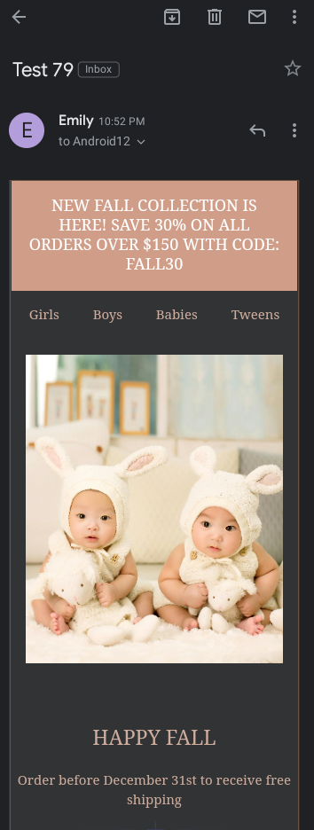
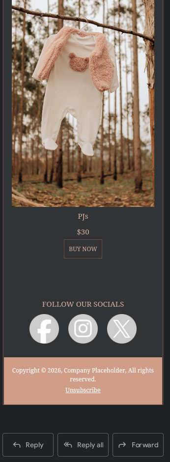
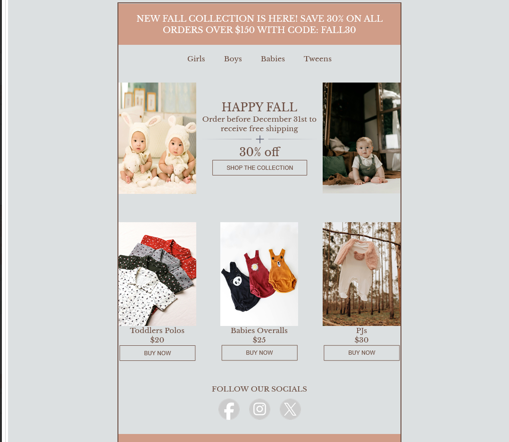

# fall-collection-email

Responsive email template designed for cross-client compatibility

## Features
- Fully responsive layout
- Tested in Gmail, Outlook, and Apple Mail
- Dark mode support
- VML buttons for Outlook
- Modular, clean code

## Screenshots 

## How to View

### Option 1: View live in your browser (GitHub Pages)
Once GitHub Pages is enabled (see below), open:
https://emilywilson-dev.github.io/fall-collection-email/

### Option 2: View locally
1. Click **Code → Download ZIP**  
2. Unzip the folder on your computer  
3. Open `index.html` in your browser to see the layout

